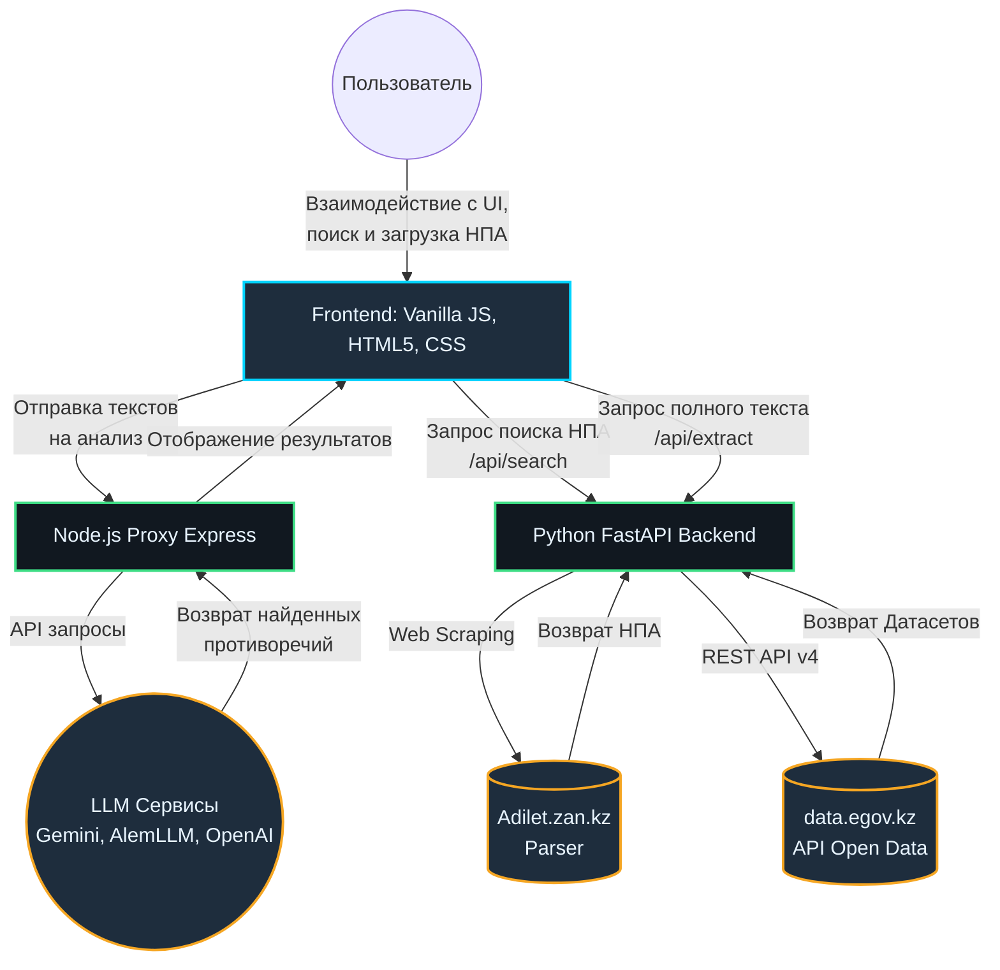

<<<<<<< HEAD
# Архитектура решения: ЗаконоМетр (Law Entropy)

Данный документ описывает высокоуровневую архитектуру прототипа системы анализа нормативно-правовых актов. 

## Общая схема архитектуры (High-Level Architecture)

Система базируется на микросервисной интеграции и разделена на клиентскую часть (Frontend), прокси-сервер (Node.js) и аналитический парсер-бэкенд (Python/FastAPI).



## Описание компонентов

### 1. Client-Side (Frontend UI)
- **Стек:** HTML5, CSS (переменные, Grid/Flexbox), Vanilla JS.
- **Модули:**
  - `File Handler`: Обработка PDF/DOCX (библиотеки PDF.js, Mammoth.js).
  - `Interactive Graph`: Визуализация графа зависимостей НПА с помощью D3.js.
  - `Parsers Integration`: Прямая связь с Python бэкендом для поиска реальных правовых актов онлайн.

### 2. Node.js Proxy Server
- **Стек:** Node.js, Express, Axios.
- **Роль:** Решает проблемы CORS при обращении к внешним LLM провайдерам, выступает как легковесный шлюз между клиентом и нейросетями. Запускает статику приложения.

### 3. Data Extraction Layer (Python FastAPI Backend)
- **Стек:** Python 3, FastAPI, Uvicorn, BeautifulSoup4.
- **Роль:** Извлечение «сырых» юридических документов из открытых государственных баз для пополнения контекста RAG (Retrieval-Augmented Generation).
- **Подмодули:**
  - `adilet_parser.py`: Эмулирует поисковые GET-запросы к базе `adilet.zan.kz`, парсит HTML ветки и извлекает чистый очищенный нормативный текст. Отключена проверка SSL (GOST) для стабильного парсинга.
  - `egov_parser.py`: Интегрируется с API Открытых данных `data.egov.kz`, преобразуя сложные JSON структуры в текстовый формат.

### 4. LLM & RAG Engine (Внешние провайдеры)
- **Стек:** REST API (Google Gemini, AlemLLM, DeepSeek, OpenAI).
- **Роль:** Получив извлеченные тексты НПА, нейросеть (LLM) анализирует их на предмет юридических коллизий, дублирования и устаревших ссылок. Вердикты возвращаются в строгом JSON-формате для отображения в UI.

## Поток данных (Data Flow)
1. Пользователь вводит ключевое слово в боковой панели UI.
2. Интерфейс опрашивает **Python FastAPI Backend**.
3. Python-бэкенд делает параллельные запросы в **Әділет** и **eGov**, собирает ссылки и отдает список в UI.
4. Пользователь выбирает конкретный документ. Бэкенд выкачивает полный текст, очищает от HTML/скриптов и передает на клиентскую часть.
5. Интерфейс упаковывает текст в специализированный промпт (Prompt Engineering) и через **Node.js Proxy** отправляет в выбранную **LLM**.
6. Нейросеть отвечает списком противоречий, которые динамически отображаются на экране пользователя в виде карточек и графа.
=======
# Архитектура проекта "Legal Entropy"

Данный проект представляет собой систему для анализа и извлечения данных из казахстанских юридических баз данных (Adilet и eGov).

## Структура репозитория

```text
.
├── backend/                # Сердце системы (Python/FastAPI)
│   ├── main.py             # Точка входа в API (FastAPI)
│   ├── parsers/            # Логика скрейпинга и парсинга
│   │   ├── adilet_parser.py # Парсер портала adilet.zan.kz
│   │   └── egov_parser.py   # Парсер открытых данных eGov
│   └── venv/               # Виртуальное окружение Python
├── tests/                  # Автоматизированные тесты (Playwright)
├── legal-entropy.html      # Фронтенд (Single Page Application)
├── server.js               # Прокси-сервер и статика (Node.js/Express)
├── package.json            # Зависимости Node.js
└── README.md               # Общее описание
```

## Технологический стек

### 1. Frontend (Клиентская часть)
*   **HTML/JS/CSS**: Реализован в файле `legal-entropy.html`.
*   **Функционал**: Интерфейс для поиска, отображения результатов и визуализации "энтропии" (анализа) текста.

### 2. API Gateway / Static Server (Node.js)
*   **Runtime**: Node.js
*   **Framework**: Express
*   **Назначение**:
    *   Раздача статических файлов (фронтенда).
    *   Проксирование запросов через `/api/proxy` для обхода ограничений CORS при прямых обращениях к внешним ресурсам.

### 3. Core Backend (Python)
*   **Framework**: FastAPI
*   **Назначение**: Высокопроизводительный API для агрегации данных.
*   **Основные компоненты**:
    *   **AdiletParser**: Использует `requests` и `BeautifulSoup4` для поиска и извлечения текстов НПА с официального портала.
    *   **EGovParser**: Взаимодействует с API открытых данных Казахстана.
*   **Endpoints**:
    *   `GET /api/search`: Поиск по ключевым словам в обеих базах.
    *   `GET /api/extract`: Извлечение полного текста документа по URL или ID.

### 4. Тестирование
*   **Framework**: Playwright (Node.js)
*   **Назначение**: End-to-end (E2E) тестирование пользовательских сценариев.

## Потоки данных (Data Flow)

1.  Пользователь вводит запрос в `legal-entropy.html`.
2.  Фронтенд отправляет запрос на `backend/main.py` (FastAPI).
3.  FastAPI запускает параллельный/последовательный поиск через `AdiletParser` и `EGovParser`.
4.  Парсеры делают HTTP-запросы к внешним государственным порталам.
5.  Данные агрегируются, очищаются и возвращаются на фронтенд в формате JSON.
6.  Фронтенд отображает результаты и позволяет запросить полный текст документа для дальнейшего анализа.
>>>>>>> 01b60eeb931bd35f33a921445785b1bf6da94037
